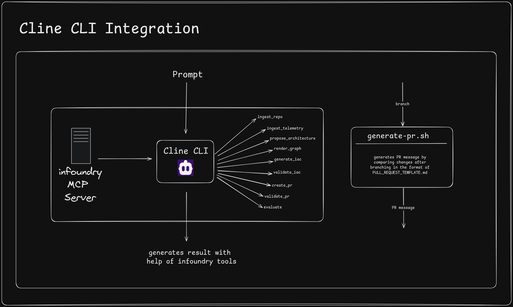
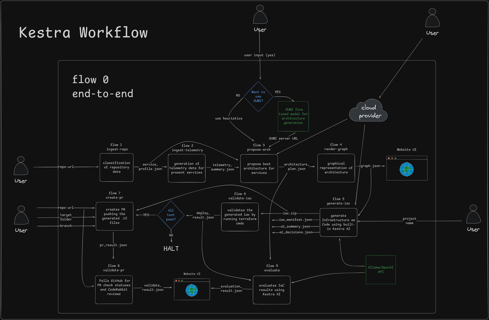
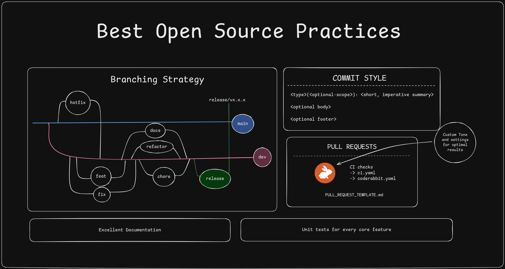
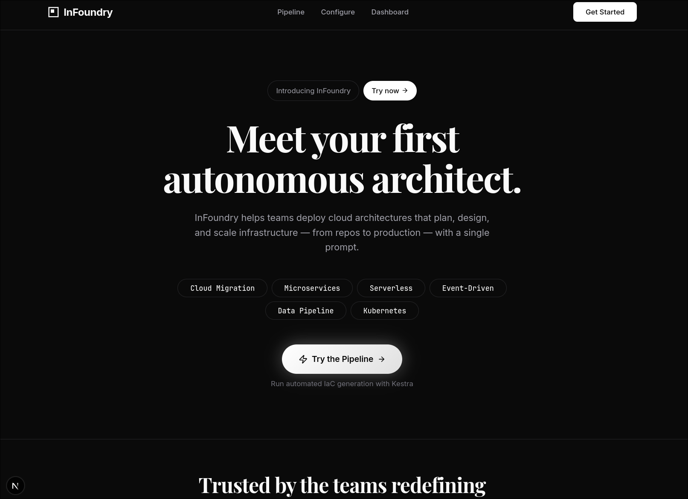
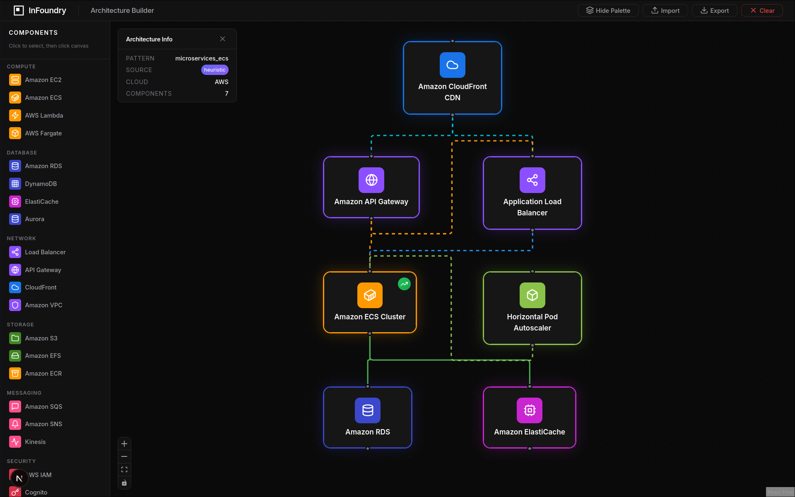
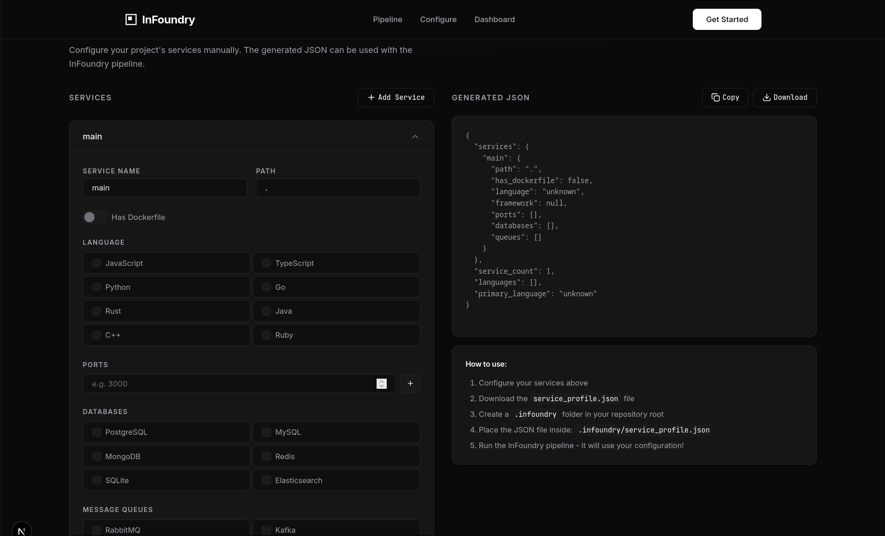
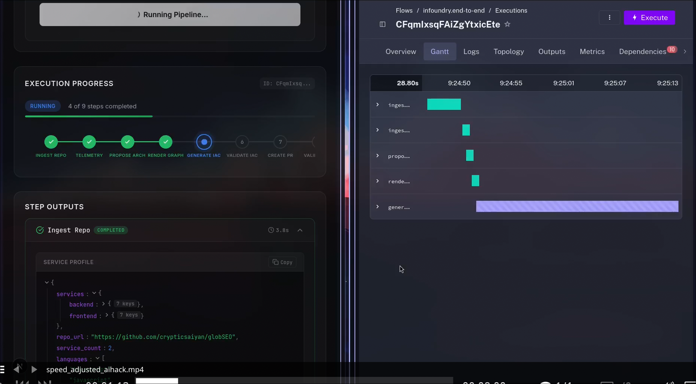

# InFoundry

InFoundry is a self-adaptive Cloud Architect + SRE agent that inspects codebases and telemetry, proposes deployable IaC/CI changes, runs safe test deployments, and iteratively optimizes cost, latency, and reliability with human-in-the-loop approvals.

## Features

- **AI-Powered Architecture Recommendations** - Uses fine-tuned Oumi model for intelligent cloud architecture decisions
- **Kestra Pipeline Orchestration** - End-to-end workflow from repo analysis to PR creation
- **MCP Server for Cline Integration** - Expose all tools via Model Context Protocol
- **React UI Dashboard** - Visual architecture editor with React Flow
- **IaC Generation** - Automatic Terraform generation for AWS

## Quick Start

### Prerequisites
- Python 3.11+
- Node.js 18+
- Optional: Docker, kind, localstack

### Installation

```bash
# Clone the repository
git clone https://github.com/your-org/infoundry.git
cd infoundry

# Install Python dependencies
pip install -r requirements.txt

# Install UI dependencies
cd ui && npm install && cd ..

# Install MCP server dependencies
cd infoundry-mcp-server && npm install && npm run build && cd ..
```

### Run the UI
```bash
cd ui
cp .env.example .env.local
# Edit .env.local with your Kestra credentials if needed
npm run dev
# Open http://localhost:3000
```

### Run the Oumi Server
```bash
cd oumi
python serve.py
# API available at http://localhost:8000
```

## Project Structure

```
infoundry/
├── docs/                    # Documentation
├── examples/                # Sample data files
├── infoundry-mcp-server/    # Cline MCP integration
├── orchestrator/            # Kestra pipeline definitions
├── oumi/                    # AI model training & serving
├── scripts/                 # Utility scripts
├── tests/                   # Unit tests
└── ui/                      # Next.js React dashboard
```

## Documentation

- [Blueprint & Architecture](docs/BLUEPRINT.md) - Full system design
- [Kestra Architecture](docs/kestra-architecture.md) - Pipeline documentation
- [Oumi Model](oumi/README.md) - AI model training guide
- [MCP Server](infoundry-mcp-server/README.md) - Cline integration

## Testing

```bash
# Python tests
pip install pytest fastapi httpx
pytest tests/ -v

# MCP server tests
node tests/test_mcp_server.mjs
```

## Screenshots

| Screenshot | Description |
|------------|-------------|
|  | Cline MCP Integration |
|  | Kestra Pipeline Flows |
|  | Open Source Architecture |
|  | Application Screenshot |
|  | Application Screenshot |
|  | Application Screenshot |
|  | Application Screenshot |

## License

Released under the [MIT License](LICENSE).
